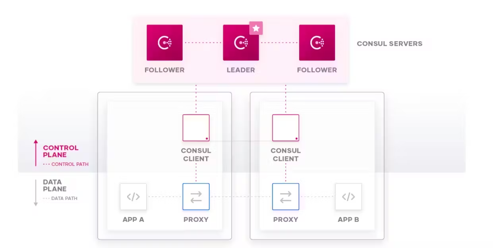
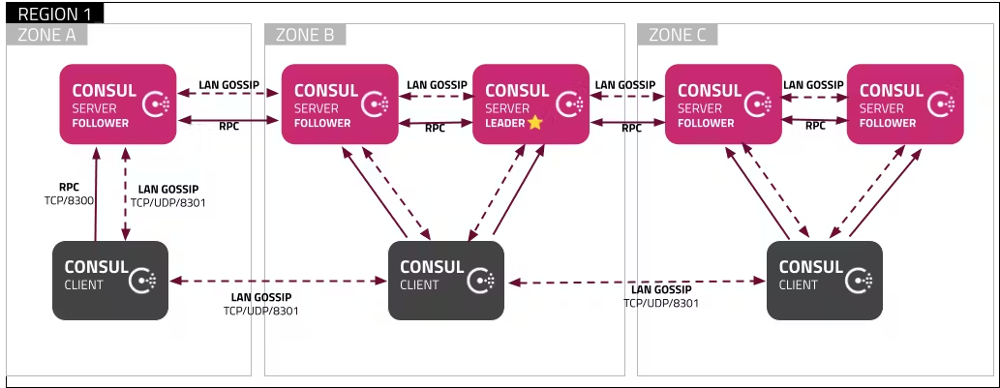
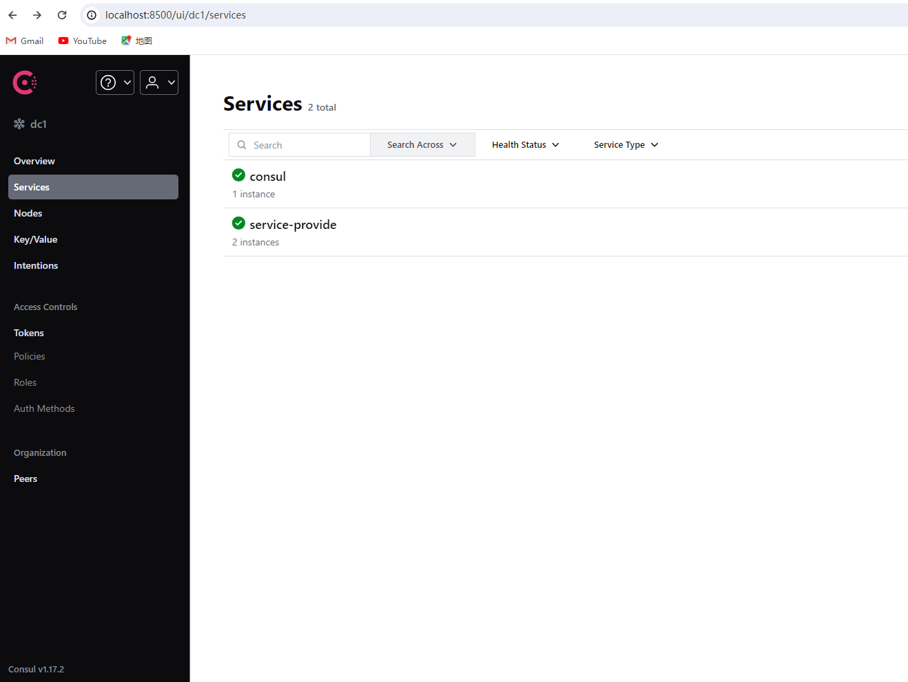
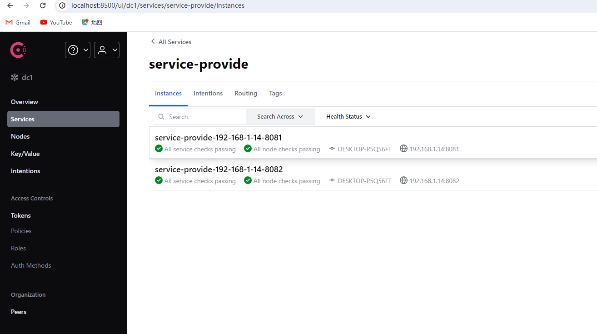

# consul 

## resource
[spring cloud consul](https://docs.spring.io/spring-cloud-consul/docs/4.0.4/reference/html/#quick-start)
[consul 官方文档](https://developer.hashicorp.com/consul/docs)
[consul demo](https://github.com/spjcodes/springCloudConsulDemo)

## what is consul 
### 简介
HashiCorp Consul 是一种服务网络解决方案，使团队能够管理服务之间以及跨本地和多云环境和运行时的安全网络连接。
Consul 提供服务发现、服务网格、流量管理和网络基础设施设备的自动更新。
可以在单个 Consul 部署中单独或一起使用这些功能。

### 功能
#### 服务发现

#### k-v存储 | 分布式存储

### ACL

#### 跨数据中心的架构

#### 服务网格 （网络隔离）

### 架构


##### 跨数据中心的高可用架构


## how to use
#### 安装
**单机** <br/>
[官网安装教程](https://developer.hashicorp.com/consul/install)

**集群**

#### springcloud集成
* 依赖
```xml
  <parent>
    <groupId>org.springframework.boot</groupId>
    <artifactId>spring-boot-starter-parent</artifactId>
    <version>3.1.0</version>
</parent>

 <properties>
    <maven.compiler.source>17</maven.compiler.source>
    <maven.compiler.target>17</maven.compiler.target>
    <project.build.sourceEncoding>UTF-8</project.build.sourceEncoding>
    <spring-cloud.version>2022.0.5</spring-cloud.version>
</properties>

<dependencies>
<!--springboot 健康监测，consul会使用其获取应用监控指标 -->
<dependency>
    <groupId>org.springframework.boot</groupId>
    <artifactId>spring-boot-starter-actuator</artifactId>
</dependency>
<!--spring及springMVC依赖-->
<dependency>
    <groupId>org.springframework.boot</groupId>
    <artifactId>spring-boot-starter-web</artifactId>
</dependency>
<!--测试套件-->
<dependency>
    <groupId>org.springframework.boot</groupId>
    <artifactId>spring-boot-starter-test</artifactId>
    <scope>test</scope>
</dependency>
<!--consul服务发现-->
<dependency>
    <groupId>org.springframework.cloud</groupId>
    <artifactId>spring-cloud-starter-consul-discovery</artifactId>
</dependency>
<!--feign远程调用依赖-->
<dependency>
    <groupId>org.springframework.cloud</groupId>
    <artifactId>spring-cloud-starter-openfeign</artifactId>
</dependency>
</dependencies>

<dependencyManagement>
<dependencies>
<!--    springCloud 依赖管理-->
    <dependency>
        <groupId>org.springframework.cloud</groupId>
        <artifactId>spring-cloud-dependencies</artifactId>
        <version>${spring-cloud.version}</version>
        <type>pom</type>
        <scope>import</scope>
    </dependency>
    <dependency>
        <groupId>org.springframework.boot</groupId>
        <artifactId>spring-boot-starter-actuator</artifactId>
        <version>3.1.0</version>
        <type>pom</type>
        <scope>import</scope>
    </dependency>
    <dependency>
        <groupId>org.springframework.boot</groupId>
        <artifactId>spring-boot-starter-web</artifactId>
        <version>3.1.0</version>
        <type>pom</type>
        <scope>import</scope>
    </dependency>
    <dependency>
        <groupId>org.springframework.boot</groupId>
        <artifactId>spring-boot-starter-test</artifactId>
        <version>3.1.0</version>
        <type>pom</type>
        <scope>test</scope>
    </dependency>
</dependencies>
</dependencyManagement>
```
* 配置
服务提供者配置
```yaml
### 服务配置
server:
  ### 服务端口
  port: 8081

### spring应用配置
spring:
  application:
    ### 应用名，同一个应用名组成一个服务组
    name: service-provide
  ### springCloud配置
  cloud:
    ### consul服务配置
    consul:
      ### consul服务ip及端口
      host: localhost
      port: 8500
      ### consul 服务发现配置
      discovery:
        ### 服务关闭时注销catalog中对于服务注册信息
        deregister: true
        ### 注册到服务发现catalog
        register: true
        ### 实例ID, 唯一
        instance-id: ${spring.application.name}:${spring.cloud.client.ip-address}:${server.port}
        ### 注册到consul中的服务名
        service-name: ${spring.application.name}
        ### 健康检查相关配置
        health-check-path: /actuator/health
        health-check-interval: 5s
        ### consul代理（agent）在通信和注册服务时使用IP地址,默认使用主机名
        prefer-ip-address: true
        ### 将应用程序的IP地址作为Consul注册的服务实例的IP地址
        ip-address: ${spring.cloud.client.ip-address} 
```
服务消费订阅者配置
```yaml
server:
  port: 9091

spring:
  application:
    name: service-subscribe-01
  cloud:
    consul:
      host: 127.0.0.1
      port: 8500
      discovery:
        ### 不注册到consul中
        register: false
```
* 开启注解
```java
@SpringBootApplication
// 启用consul服务发现客户端,服务提供者想要注册到consul注册中心中
@EnableDiscoveryClient
public class Application
{
    public static void main( String[] args )
    {
        SpringApplication.run(Application.class, args);
    }
} 
```
* 启动
启动项目中的provide和consumer服务，并观察consul webUi信息



* 测试
测试代码
```java
@RestController
        public class TestService {

        @Autowired
        private LoadBalancerClient loadBalancer;
        @Autowired
        private DiscoveryClient discoveryClient;

        @Autowired
        private TestSer testSer;

        /**
        * 获取所有服务
        */
        @RequestMapping("/services")
        public Object services() {
        return discoveryClient.getInstances("service-provide");
        }

        /**
        * 从所有服务中选择一个服务（轮询）
        */
        @RequestMapping("/discover")
        public Object discover() {
        return loadBalancer.choose("service-provide").getUri().toString();
        }
} 
```
使用负载均衡获取实例 <br>
第一次请求<br>
 <br>
第二次请求 <br>


<br><hr/>

# feign
* [官方文档](https://github.com/OpenFeign/feign)
* [springCloudOpenFeign官方文档](https://docs.spring.io/spring-cloud-openfeign/reference/spring-cloud-openfeign.html)
* [springCloud demo](https://github.com/spring-cloud-samples/feign-eureka)
* [demo](https://spring-cloud-wiki.readthedocs.io/zh-cn/latest/pages/feign.html)
* [开源地址](https://github.com/OpenFeign/feign)

## what is Feign
Feign是一个声明式的Web Service客户端，简化了编写服务之间的HTTP通信代码的过程。
Feign提供了HTTP请求的模板，通过编写简单的接口和注解，就可以定义好HTTP请求的参数、格式、地址等信息。
Feign会完全代理HTTP请求，开发时只需要像调用方法一样调用它就可以完成服务请求及相关处理。
OpenFeign整合了Ribbon负载和Hystrix熔断，可以不再需要显式地使用这两个组件。
Feign具有如下特性：
* 可插拔的注解支持，包括Feign注解和JAX-RS注解;
* 支持可插拔的HTTP编码器和解码器;
* 支持Hystrix和它的Fallback;
* 支持Ribbon的负载均衡;

## how to usage
### 依赖添加
```xml
 <dependencies>
        <dependency>
            <groupId>org.springframework.boot</groupId>
            <artifactId>spring-boot-starter-actuator</artifactId>
        </dependency>
        <dependency>
            <groupId>org.springframework.boot</groupId>
            <artifactId>spring-boot-starter-web</artifactId>
        </dependency>
        <dependency>
            <groupId>org.springframework.boot</groupId>
            <artifactId>spring-boot-starter-test</artifactId>
            <scope>test</scope>
        </dependency>
        <dependency>
            <groupId>org.springframework.cloud</groupId>
            <artifactId>spring-cloud-starter-consul-discovery</artifactId>
        </dependency>
        <dependency>
            <groupId>org.springframework.cloud</groupId>
            <artifactId>spring-cloud-starter-openfeign</artifactId>
        </dependency>
    </dependencies>
```
### 配置
#### 客户端配置
controller
```java
@RestController
public class TestService {

    @Autowired
    private LoadBalancerClient loadBalancer;
    @Autowired
    private DiscoveryClient discoveryClient;

    @Autowired
    private RestTemplate restTemplate;

    @Autowired
    private TestSerImpl testSer;

    /**
     * 获取所有服务
     */
    @RequestMapping("/services")
    public Object services() {
        return discoveryClient.getInstances("service-provide");
    }

    /**
     * 从所有服务中选择一个服务（轮询）
     */
    @RequestMapping("/discover")
    public Object discover() {
        return loadBalancer.choose("service-provide").getUri().toString();
    }

    @GetMapping("getListByDiscover")
    public Object getListsByDiscover() {
        URI serviceId = loadBalancer.choose("service-provide").getUri();
        return restTemplate.getForEntity(serviceId+"/getList",  String.class);
    }

    /**
     * 服务远程调用consul中注册的provide服务中的方法实现，具体实现为testSer接口和实现类中
     * @return
     */
    @GetMapping("/getList")
    @ResponseBody
    public List<String> getList() {
        return testSer.getList();
    }
}

```
serviceImpl
```java
@Service
public class TestSerImpl implements TestSer {
    // 注入feign客户端
    @Autowired
    private TestSer testSer;

    @Override
    public List<String> getList() {
        return testSer.getList().stream().map(e -> String.valueOf(Arrays.hashCode(e.getBytes()))).toList();
    }
}
```
services
```java
/**
 * 声明为feign客户端
 * 创建一个具有该接口的REST客户端（例如，用于自动装配到另一个组件中）。
 * 如果可用，将使用SC LoadBalancer来负载均衡后端请求，并且可以使用与Feign客户端相同的名称（即值）配置负载均衡器。
 */
@FeignClient("service-provide")
public interface TestSer {

    /**
     * feign 内部集成了 rabbion 和resultTemplate并且实现了SpringMVC可使用SpringMVC的注解来实现负载均衡和远程服务调用
     * @return
     */
    @GetMapping("getList")
    public List<String> getList();
}
```

#### 服务端配置
```java
@Controller
public class Test {

    @Autowired
    private TestSer testSer;


    @GetMapping("getList")
    @ResponseBody
    public List<String> getList() {
        System.out.println("provide_01");
        return testSer.getList();
    }
}
```
### 服务消费者注解配置
```java
@SpringBootApplication
//开启feign客户端
@EnableFeignClients
public class Application
{
    public static void main( String[] args )
    {
        SpringApplication.run(Application.class, args);
    }
}
```
### 启动及测试
服务提供者调用测试<br>
<br>
<br>
feign代理客户端服务调用<br>
<br>
<br>
测试结果可见，其成功调用了service-provide应用[service-provide-192-168-1-14-8081和service-provide-192-168-1-14-8082]的`/getList`接口,
且并没有显示的调用loadBalancer,但实现了和discover方法一样的效果